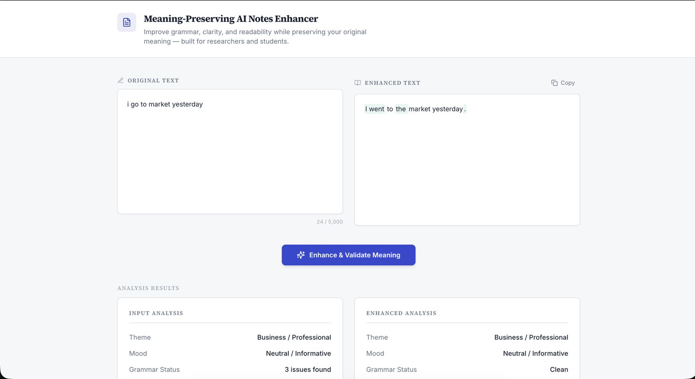
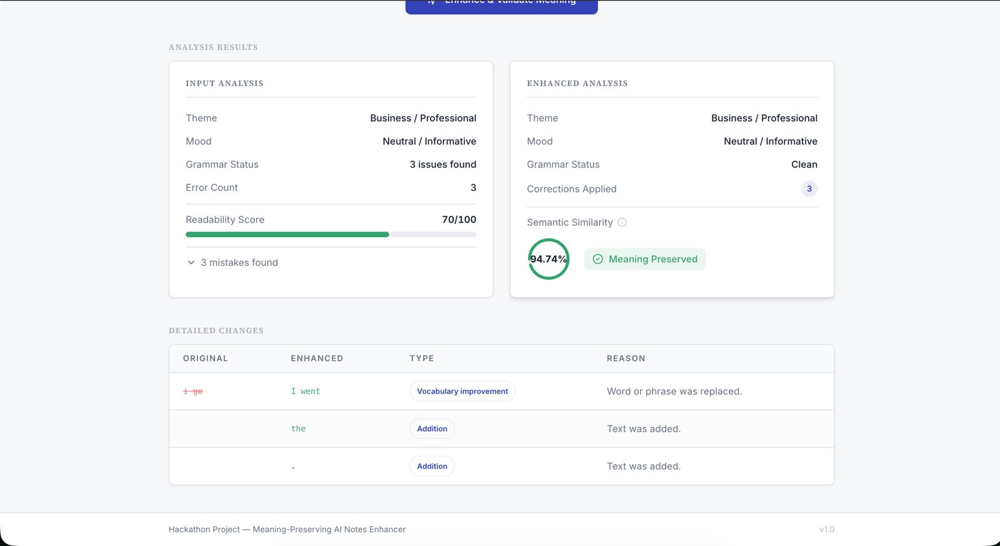

# Meaning‑Preserving AI Notes Enhancer

AI-powered text enhancement that fixes grammar and clarity while preserving meaning.

## Live Demo
- Frontend: https://text-enhancer-11uc.onrender.com
- Backend API: https://meaningpreservingtextenhancer.onrender.com/
- Deployed via Render (Static Site for frontend, Web Service for backend).


## Tech Stack
- Backend
  - Node.js 18+, Express 5
  - Axios (HTTP), dotenv (env), diff (word diff)
  - Google Gemini APIs: gemini-2.5-flash (content), gemini-embedding-001 (embeddings)
- Frontend
  - React 18, TypeScript, Vite 5 (SWC React plugin)
  - Tailwind CSS, shadcn/ui (Radix UI wrappers)
  - @tanstack/react-query, react-router-dom
  - lucide-react, recharts, date-fns, zod
- Tooling
  - ESLint (typescript-eslint), Vitest + Testing Library
  - Tailwind plugins (tailwindcss-animate)

## Folder Structure
```
.
├─ Text-Enhancer/
│  ├─ server.js                 # Express app entry (port 3000)
│  ├─ package.json
│  ├─ routes/
│  │  └─ enhance.js             # /enhance endpoint
│  ├─ services/
│  │  ├─ gemini.js              # Gemini calls + local fallback
│  │  └─ cache.js               # Simple in-memory cache
│  ├─ utils/
│  │  ├─ classifier.js          # Change classification (LLM + fallback)
│  │  ├─ diff.js                # Change detection
│  │  └─ similarity.js          # Word/char/embedding similarity
│  └─ meaning-mint/             # Frontend (Vite React app on 8080)
│     ├─ index.html
│     ├─ vite.config.ts
│     ├─ package.json
│     ├─ public/
│     │  ├─ favicon.ico
│     │  ├─ placeholder.svg
│     │  └─ screenshots/        # Place README images here
│     └─ src/
│        ├─ main.tsx, App.tsx
│        ├─ pages/
│        │  └─ Index.tsx
│        ├─ components/
│        │  ├─ TextPanel.tsx
│        │  ├─ AnalysisCard.tsx
│        │  ├─ ChangeLogTable.tsx
│        │  └─ ui/              # shadcn UI components
│        ├─ lib/
│        │  ├─ apiEnhancer.ts   # Calls backend /enhance
│        │  └─ utils.ts
│        ├─ hooks/
│        └─ test/
└─ README.md (this file)
```

## Getting Started

### Prerequisites
- Node.js 18+ and npm
- A valid GEMINI_API_KEY (if using online enhancement)

### Environment (backend)
Create a `.env` at repo root:
```
GEMINI_API_KEY="your_key_here"
# Optional behavior flags
ENABLE_EMBEDDINGS=true
ENABLE_CLASSIFICATION=true
DISABLE_GEMINI=false
MAX_OUTPUT_TOKENS=400
TARGET_SIMILARITY=85
FALLBACK_LOCAL_ENHANCE=true
```
Do not commit `.env` files.

### Install
```bash
cd Text-Enhancer
npm ci
cd meaning-mint
npm ci
```

### Run (Development)
1) Backend (port 3000)
```bash
cd Text-Enhancer
node server.js
```
- Health: GET http://localhost:3000/
- Enhance: POST http://localhost:3000/enhance with body `{ "text": "..." }`

2) Frontend (port 8080)
```bash
cd Text-Enhancer/meaning-mint
npm run dev
```
Open http://localhost:8080/

The frontend calls http://localhost:3000/enhance directly. CORS is enabled for local development.

## Screenshots
<p align="center">
  
</p>
<p align="center">
  
</p>

## Quality Checks (Frontend)
```bash
cd Text-Enhancer/meaning-mint
npm run lint
npm run test
npm run build
```

## Production Notes
- Restrict CORS in server.js for production
- Provide env variables via your deployment platform
- Optional backend script:
  ```json
  { "scripts": { "start": "node server.js" } }
  ```

## License
MIT
