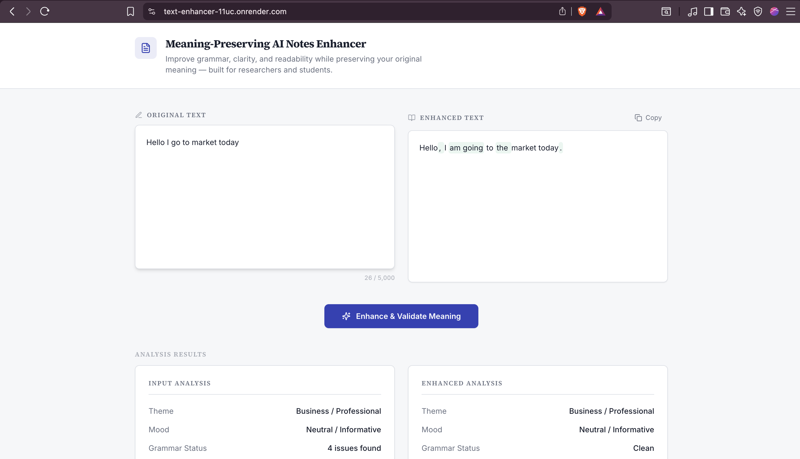
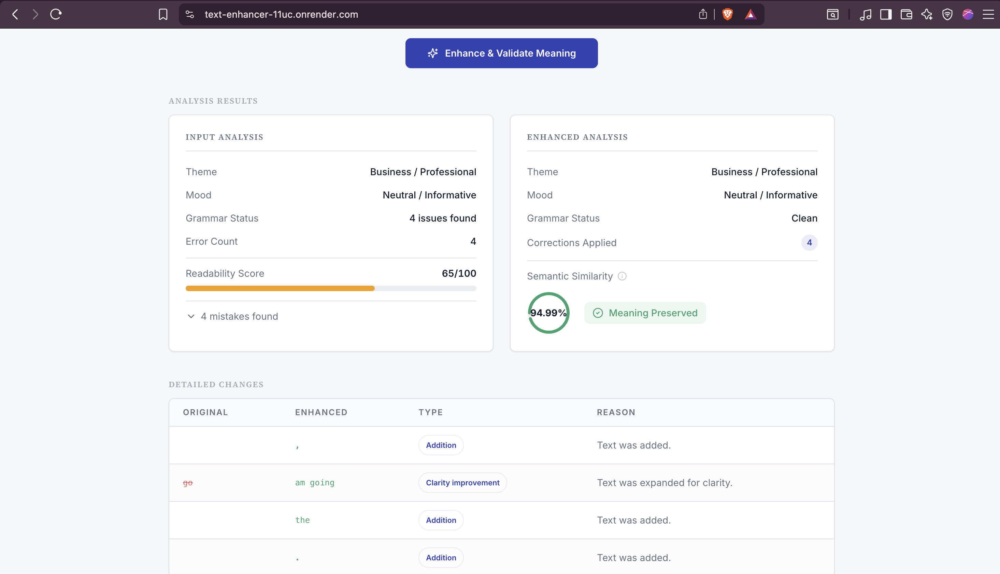

# Text Enhancer Frontend

React + Vite + TypeScript UI for the Meaning‑Preserving AI Notes Enhancer.

## Live Demo
- Frontend: https://text-enhancer-11uc.onrender.com
- Backend API: https://meaningpreservingtextenhancer.onrender.com/
- Deployed via Render (Static Site for frontend).

## Setup
```sh
cd Text-Enhancer/meaning-mint
npm install
npm run dev
```

## Notes
- Uses shadcn-ui, Tailwind CSS, and React Query
- Production calls: https://meaningpreservingtextenhancer.onrender.com/enhance

## Screenshots
From public/NewScreenshots:




